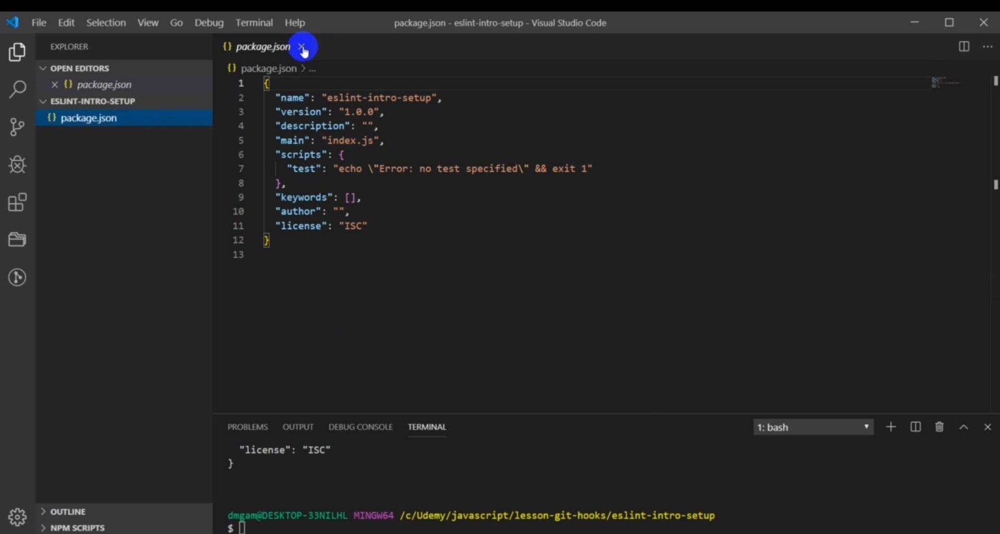
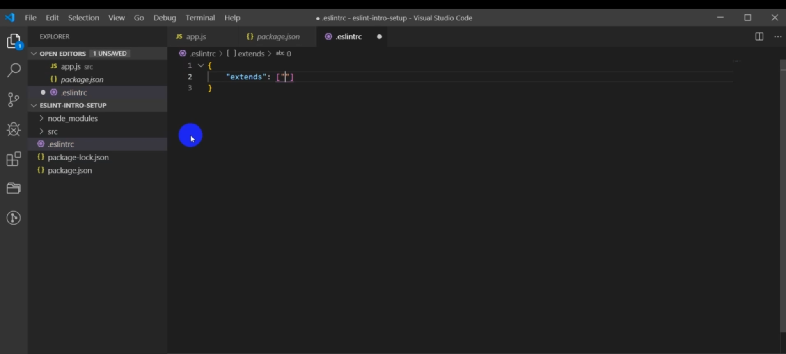
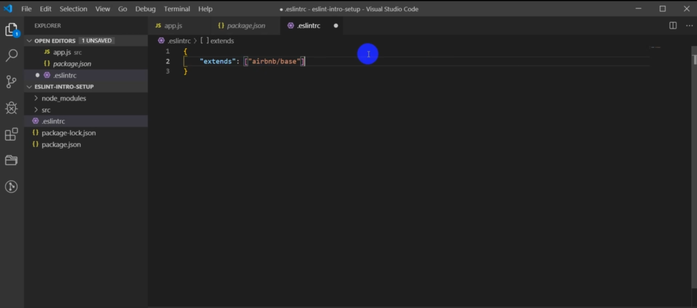
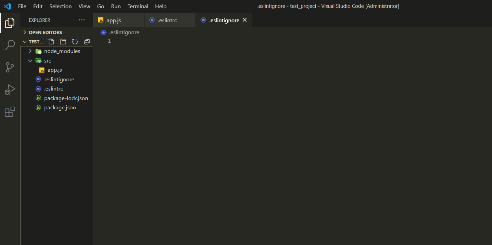
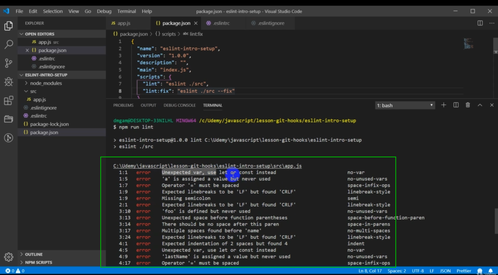
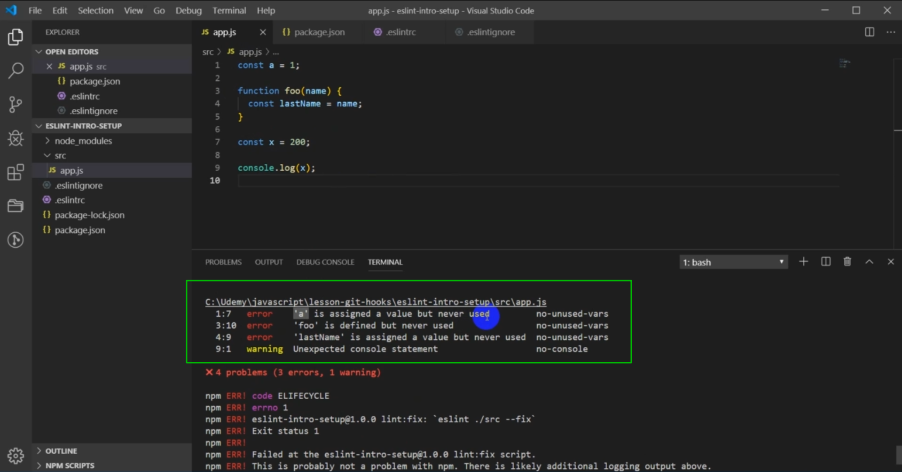

# Установка и базовыве настройки.

Первое что нужно сделать это инициализировать **npm**.

```shell
npm init -y
```

флаг **-y** говорит что я со всем согласен. Происходит формирование **JSON** и мы не отвечаем на вопросы.



````json
{
  "name": "test_project",
  "version": "1.0.0",
  "description": "",
  "main": "index.js",
  "scripts": {
    "test": "echo \"Error: no test specified\" && exit 1"
  },
  "keywords": [],
  "author": "",
  "license": "ISC"
}
```

Устанавливаю сам **lint**

```shell
npm i --save-dev eslint
````

Создаю папку **src** и в нем **app.js**. Далее устанавливаю следующие пакеты.

```shell
npm i --save-dev eslint-config-airbnb eslint-config-prettier eslint-plugin-html eslint-plugin-import eslint-plugin-jsx-a11y eslint-plugin-prettier
```

**eslint-config-airbnb** - есть style gide про airnbn который вы можете посмотреть на GitHub репозиторий с документацией.

**eslint-config-prettier** - нам нужен для правильной совместной работы prettier и непосредственно eslint.

**eslint-plugin-html** - он нужен для того что бы линтить ошибки в теге script в html.

**eslint-plugin-import** - он нужен для того что бы поддерживать синтаксис import export и он помогает предотвращать проблемы связанных с неправильным написанием путей к файлам.

**eslint-plugin-jsx-a11y** - он предоставляет правила касающиеся доступности для людей с ограниченными возможностями.

**eslint-plugin-prettier** - Сам prettier.


Теперь что бы **eslint** работал нам нужно создать специальный файл в корне проекта **.eslintrc**. Если мы его создаем без расширения **js** то мы в нем просто пишем объект. Если с расширением **js** мы пишем **module.export** как в **webpack**.

В этом объекте пишу пока единственное совойство **extends**. Это свойство предоставляет массив конфигураций которые мы хотим применять к своему проекту в рамках **eslint**



передаю **airbnb** конфигурацию, но по **default** **airbnb** требует дополнительно плагинов связанных с **React** если нам это не нужно мы ставим **airbnb/base** и этого будет достаточно.



```json
{ "extends": "airbnb/base" }
```

Мы можем перечислять несколько конфигураций. Они будут расширять каждое друг за другом т.е. если у нас будет еще одна конфигурация она рассширит **airbnb**. В следующих уроках мы более подробно познакомимся с разделами **eslint**.

Если у нас весь код находится в папке src то у нас проблем не будет. Если же код находится в корневой дирректории, то вам может понадобится создать специальный файл **.eslintignore**.



В этом файле вы можете прописать адреса папок которые линтер не должен просматривать и в общем-то выдавать по ним ошибки. Например у нас это папка **node_modules**.

```
node_modules
/.vscode
/.git
```

Напишу плохой код в **app.js**.

```js
var a = 1;

function foo(name) {
  var lastName = name;
}

var x = 200;

console.log(x);
```

Сейчас так как **Linter** не установлен в **VS Code** у меня эти все ошибки не подсвечиваются. Если его установить то все настройки в зависимости от конфигурации **eslint** будут подсвечиваться.

Теперь в **package.json** добавляю два скрипта которые у нас будут запускать linter. **"lint": "eslint ./src"** здесь я указываю **./src** куда **eslint** должен пройти что бы проверить эти файлы.
И так же я добавлю **"lint:fix": "eslint ./src --fix"** эта команда будет выполнять **fix** тех файлов которые требуют изменений и не имеют нарушения в соответсвии со стандартной конфигурацией **eslint**.

```json
{
  "name": "test_project",
  "version": "1.0.0",
  "description": "",
  "main": "index.js",
  "scripts": {
    "lint": "eslint ./src",
    "lint:fix": "eslint ./src --fix"
  },
  "keywords": [],
  "author": "",
  "license": "ISC",
  "devDependencies": {
    "eslint": "^7.12.1",
    "eslint-config-airbnb": "^18.2.0",
    "eslint-config-prettier": "^6.15.0",
    "eslint-plugin-html": "^6.1.0",
    "eslint-plugin-import": "^2.22.1",
    "eslint-plugin-jsx-a11y": "^6.4.1",
    "eslint-plugin-prettier": "^3.1.4"
  }
}
```

Теперь если я в терминале напишу команду

```shell
npm run lint
```

то он запустит **eslinter**



И вот для такого маленького файла он нам выдал кучу ошибок.

Теперь попробуем запустить **lint fix** и посмотрим что произойдет.

```shell
npm run lint:fix
```

И вот он наш пофиксеный код

```js
const a = 1;

function foo(name) {
  const lastName = name;
}

const x = 200;

console.log(x);
```

Осталось несколько ошибок которые он не может изменить.



Если мы установим плагин **ESLint** [https://marketplace.visualstudio.com/items?itemName=dbaeumer.vscode-eslint](https://marketplace.visualstudio.com/items?itemName=dbaeumer.vscode-eslint)
то теперь он нам будет подсвечивать наши ошибки и warning в том числе.
