# Eslint правила, окружение, настройка редактора.

**Eslint** позволяет указывать определенные правила которые мы хотим исключить или же если мы хотим на какую-то ошибку **warning** и наоборот. Т.е у нас сейчас **console.log** подсвечивается желтым это **warning**. А я хочу что бы это была именно ошибка. Это все можно настраивать в файле **.eslintrc**

Первое что мы должны сделать это настроить **enviroment**(окружение) для нашего **eslint**. Дело в том что если я сейчас попробую обратится к **console.log(window);** Оно подсвечивается ошибкой.

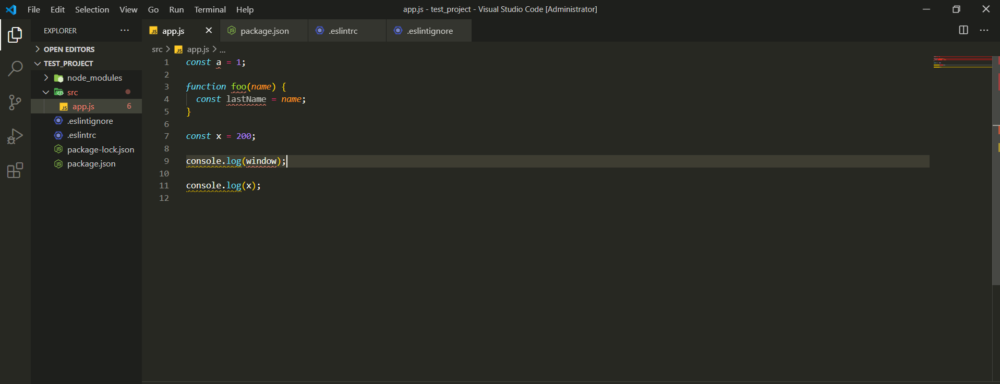

У меня будет ошибка что **window is not defined**.

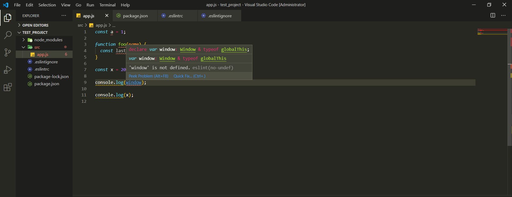

Для того что бы eslint дать возможность в каком **environment** мы работаем т.е. в каком окружении мы работаем, мы можем в **ESlint** передать специальную настройку, называется она **"env":{}** и как раз здесь указать свойство **"browser": true**. Это значит что мы работаем в рамках браузера.

```json
// .eslintrc
{
  "env": {
    "browser": true
  },
  "extends": ["airbnb/base"]
}
```

Теперь **window** не подсвечивается так как он знает что есть такая глобальная переменная. В том числе мы в **environment** можем добавить **"es6": true** и мы можем еще добавить **"node": true**.

```json
// .eslintrc
{
  "env": {
    "browser": true,
    "es6": true,
    "node": true
  },
  "extends": ["airbnb/base"]
}
```

Все эти настройки я могу прочитать на их официальном сайте в разделе **user guide**.

[https://eslint.org/](https://eslint.org/)

Следующий важный раздел **ESlint** называется он **rules**(правила). Он помогает кастомно настроить те или иные правила т.е. возможно какие-то вещи из **airbnb** или еще чего либо вам не подходят и вы хотите более тонко настроить ваш **ESlint** конкретно под работу вашей команды и т.д. Для этого есть как раз таки правила. И как мы видим при работе например с **console.log** или например если мы не поставим точку с запятой. Нам указывается что это за ошибка, так же указывается какое правило за это отвечает.

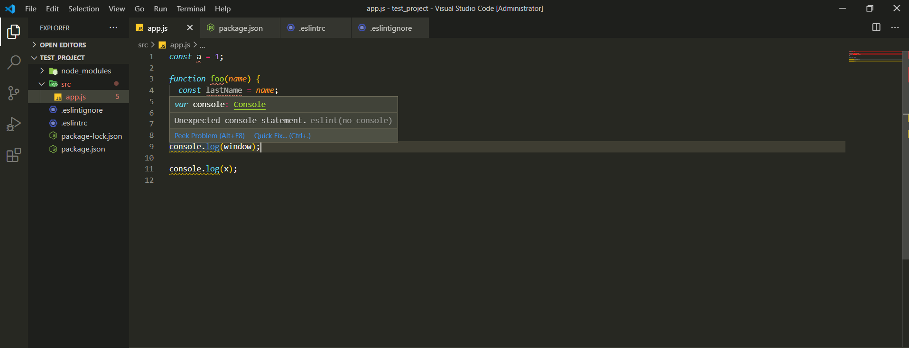

**no-console** правило которое за это отвечает.

Посмотрим на одни из самых распостраненных ошибок, конечно их гораздо больше, но тем не менее. Правило для кавычек **semi** я могу указать что бы подсвечивалась как ошибка, предупреждение или вовсе отключить.

```js
// .eslintrc
{
  "env": {
    "browser": true,
    "es6": true,
    "node": true
  },
  "extends": ["airbnb/base"],
  "rules": {
    "semi": "off"
  }
}
```

Теперь у меня не будут подсвечиваться точки с запятыми как ошибки. Хотя я это правило оставляю включенным.

C **console.log** правило **no-console**. Данное правило помогает нам определить как реагировать на присутствие **console.log**.

```json
// .eslintrc
{
  "env": {
    "browser": true,
    "es6": true,
    "node": true
  },
  "extends": ["airbnb/base"],
  "rules": {
    "semi": "off",
    "no-console": "off"
  }
}
```

Я могу навестись на нужную мне область и выбрать что сделать. Отключить данное правило на строку, на файл и т.д. Нажимаю на **Quick fix** и выбираю что сделать.

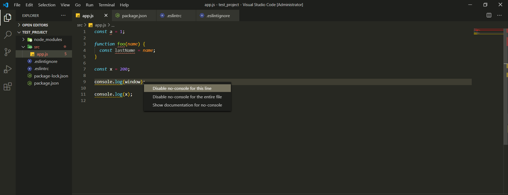

Следущая ошибка это использование **++**

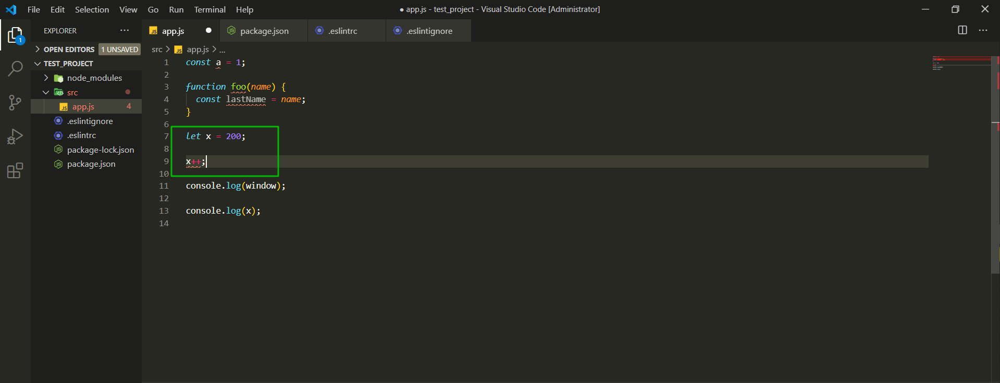

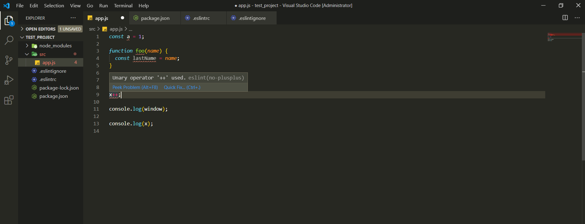

Так же в настройках отключаю это.

```json
// .eslintrc
{
  "env": {
    "browser": true,
    "es6": true,
    "node": true
  },
  "extends": ["airbnb/base"],
  "rules": {
    "semi": "off",
    "no-console": "off",
    "no-plusplus": "off"
  }
}
```

Дальше у нас есть так называемый **eol-last**. У нас должна быть обязательно пустая строка в конце файла. Кстати часть этих правил потдается настройке, но так же и исключениям т.е. правило можно еще варировать в зависимости от каких-то определенных ситуаций.

```json
// .eslintrc
{
  "env": {
    "browser": true,
    "es6": true,
    "node": true
  },
  "extends": ["airbnb/base"],
  "rules": {
    "semi": "off",
    "no-console": "off",
    "no-plusplus": "off",
    "eol-last": "off"
  }
}
```

Дальше у нас есть максимальная длинна строки. Если я напишу к примеру **104** символа у меня выведется ошибка что допустимо только **100**. Мы можем указать какую максимальную длинну мы хотим иметь для наших строк. Например я хочу выводить ошибку если длинна строки будет больше **150**.

```js
// .eslintrc
{
  "env": {
    "browser": true,
    "es6": true,
    "node": true
  },
  "extends": ["airbnb/base"],
  "rules": {
    "semi": "off",
    "no-console": "off",
    "no-plusplus": "off",
    "eol-last": "off",
    "max-len": ["error", 150]
  }
}
```

Далее смотрим стрелочные функции **const arrow = () => {};**

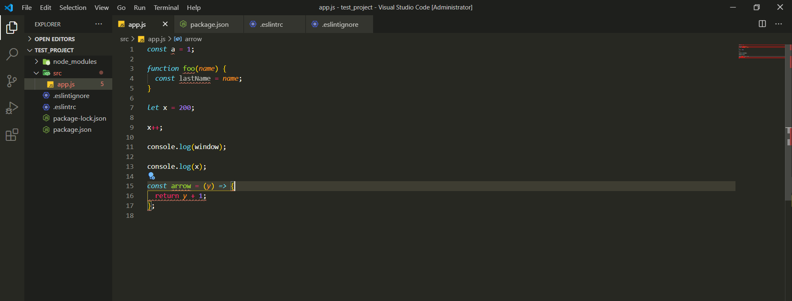

```js
const a = 1;

function foo(name) {
  const lastName = name;
}

let x = 200;

x++;

console.log(window);

console.log(x);

const arrow = (y) => {
  return y + 1;
};
```

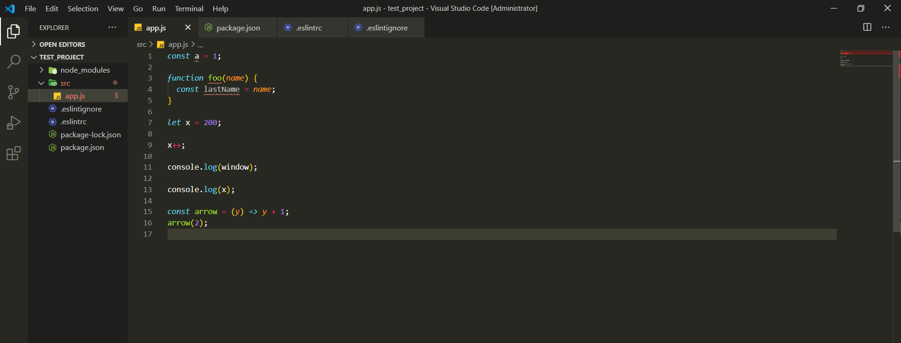

И у нас здесь говориться что если у нас одна операция мы не должны использовать фигурные скобки. Мы должны сразу после стрелки писать результат без ключевого слова **return**.

```js
const a = 1;

function foo(name) {
  const lastName = name;
}

let x = 200;

x++;

console.log(window);

console.log(x);

const arrow = (y) => y + 1;
arrow(2);
```

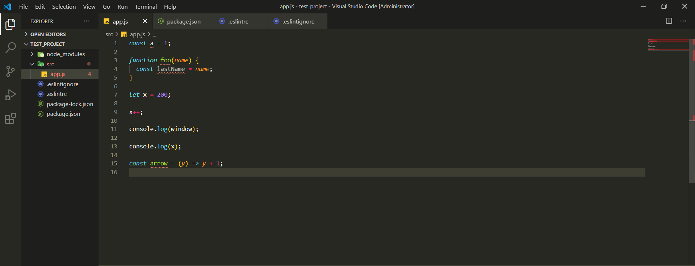

Так же здесь мы можем использовать настройки **no-alert** не запрещаем использовать.

```json
// .eslintrc
{
  "env": {
    "browser": true,
    "es6": true,
    "node": true
  },
  "extends": ["airbnb/base"],
  "rules": {
    "semi": "off",
    "no-console": "off",
    "no-plusplus": "off",
    "eol-last": "off",
    "max-len": ["error", 150],
    "no-tabs": "off",
    "no-alert": "off"
  }
}
```

Так же у нас например если есть какой-то объект то следующая ошибка это то что если я захочу вытянуть **name**.

```js
const a = 1;

function foo(name) {
  const lastName = name;
}

let x = 200;

x++;

console.log(window);

console.log(x);

const arrow = (y) => y + 1;
arrow(2);

const obj = {
  name: 'Konstantine',
};

const name = obj.name;
```

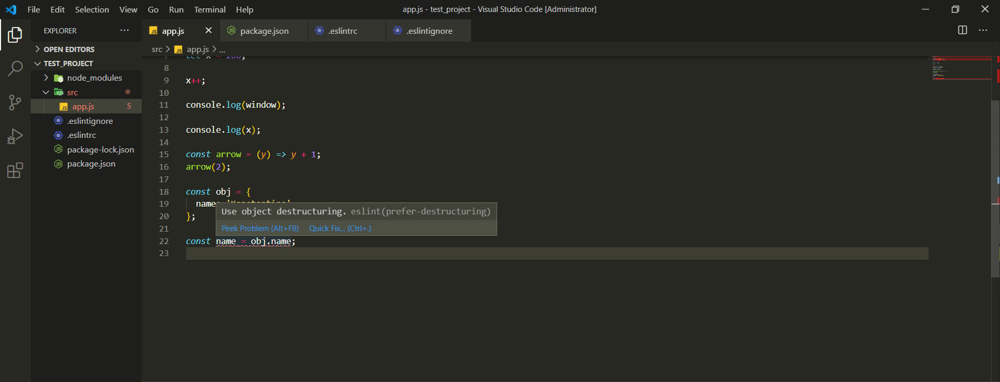

В ошибке говориться что я должен использовать деструктуризацию. Это иногда напрягает потому что где-то вы не хотите использовать деструктуризацию, хотя в целом это полезно.
Мы это можем так же отключить.

```json
// .eslintrc
{
  "env": {
    "browser": true,
    "es6": true,
    "node": true
  },
  "extends": ["airbnb/base"],
  "rules": {
    "semi": "off",
    "no-console": "off",
    "no-plusplus": "off",
    "eol-last": "off",
    "max-len": ["error", 150],
    "no-tabs": "off",
    "no-alert": "off",
    "prefer-destructuring": "off"
  }
}
```

Теперь он только подсвечивает что переменная **name** не используется.

Про ошибку **indentation** хотя у меня ее нет. Почитай что это. Так же ее убираю **"indent": "off"**. Не происходит проверка пробелов и **tab**.

```json
// .eslintrc
{
  "env": {
    "browser": true,
    "es6": true,
    "node": true
  },
  "extends": ["airbnb/base"],
  "rules": {
    "semi": "off",
    "no-console": "off",
    "no-plusplus": "off",
    "eol-last": "off",
    "max-len": ["error", 150],
    "no-tabs": "off",
    "no-alert": "off",
    "prefer-destructuring": "off",
    "indent": "off"
  }
}
```

Но так же **indent** я могу настроить более подробно если значение укажу ввиде массива. Помимо этого в **indent** я могу добавить **"error", 2**.

```js
// .eslintrc
{
  "env": {
    "browser": true,
    "es6": true,
    "node": true
  },
  "extends": ["airbnb/base"],
  "rules": {
    "semi": "off",
    "no-console": "off",
    "no-plusplus": "off",
    "eol-last": "off",
    "max-len": ["error", 150],
    "no-tabs": "off",
    "no-alert": "off",
    "prefer-destructuring": "off",
    "indent": ["off", "tab", "error", 2]
  }
}
```

Для того что бы настроить возможность и табов и пробелов мы указываем в другом чуть чуть порядке. Мы должны указать количество пробелов **2**, и дальше указать что мы разрешаем **"tab"**

```js
// .eslintrc
{
  "env": {
    "browser": true,
    "es6": true,
    "node": true
  },
  "extends": ["airbnb/base"],
  "rules": {
    "semi": "off",
    "no-console": "off",
    "no-plusplus": "off",
    "eol-last": "off",
    "max-len": ["error", 150],
    "no-tabs": "off",
    "no-alert": "off",
    "prefer-destructuring": "off",
    "indent": [2, "tab"]
  }
}
```

Так же в **indent** мы можем передавать объекты с настройками. Задавать конкретно для каких ситуаций мы хотим какое количество пробелов.
Такая более тонкая настройка доступна для любого правила. Мы можем выбрать какое-то правило и соответственно посмотреть какие настройки для него доступны [indent](https://eslint.org/docs/rules/indent-legacy#enforce-consistent-indentation-indent-legacy)

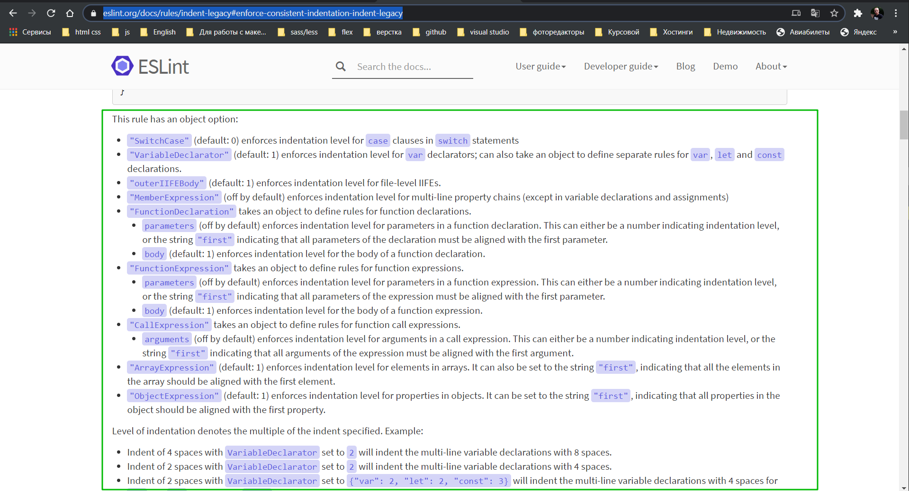

Здесь указывается что мы можем создавать объект и указывать для конкретных каких-то ситуаций различные отступы. Т.е. например могу указыать что в **Swith Case** у меня может быть такое-то количество отступов. Это все можно очень тонко настраивать.

```json
// .eslintrc
{
  "env": {
    "browser": true,
    "es6": true,
    "node": true
  },
  "extends": ["airbnb/base"],
  "rules": {
    "semi": "off",
    "no-console": "off",
    "no-plusplus": "off",
    "eol-last": "off",
    "max-len": ["error", 150],
    "no-tabs": "off",
    "no-alert": "off",
    "prefer-destructuring": "off",
    "indent": [2, "tab", {}]
  }
}
```

Бывает такое что вы можете переопределять параметры, это так же запрещено по **default**.

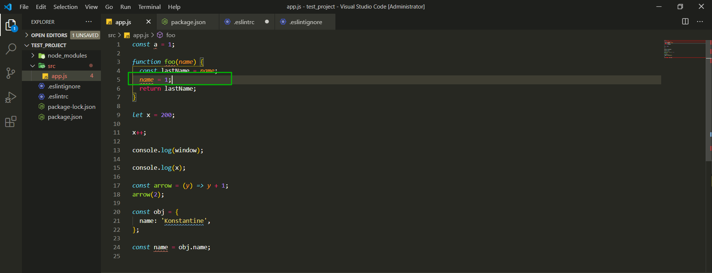

```js
const a = 1;

function foo(name) {
  const lastName = name;
  name = 1;
  return lastName;
}

let x = 200;

x++;

console.log(window);

console.log(x);

const arrow = (y) => y + 1;
arrow(2);

const obj = {
  name: 'Konstantine',
};

const name = obj.name;
```

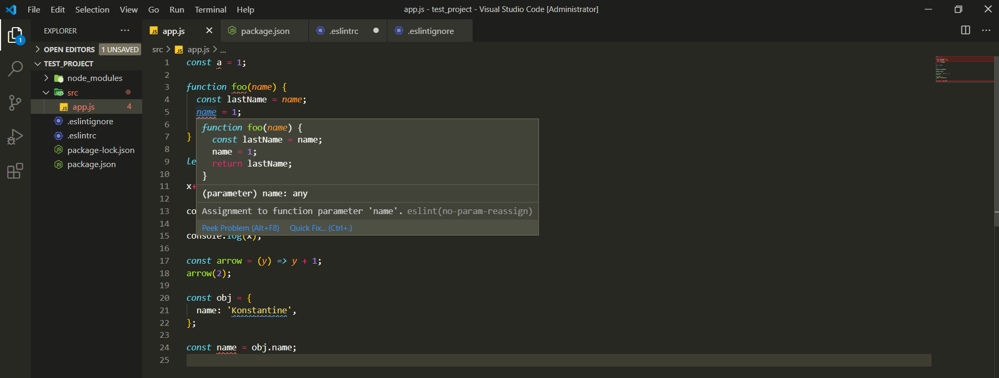

Это можно так же запретить **"no-param-reassign": "off"**.

```json
// .eslintrc
{
  "env": {
    "browser": true,
    "es6": true,
    "node": true
  },
  "extends": ["airbnb/base"],
  "rules": {
    "semi": "off",
    "no-console": "off",
    "no-plusplus": "off",
    "eol-last": "off",
    "max-len": ["error", 150],
    "no-tabs": "off",
    "no-alert": "off",
    "prefer-destructuring": "off",
    "indent": [2, "tab"],
    "no-param-reassign": "off"
  }
}
```

Некоторые правила мы разобрали. Их реально довольно много. Советую посмотреть по документации и подобрать более комфортные для вас.

Кстати для **max-len** есть такая настройка игнорировать **url** потому что они могут быть длинее чем указанное количество символов.

```json
// .eslintrc
{
  "env": {
    "browser": true,
    "es6": true,
    "node": true
  },
  "extends": ["airbnb/base"],
  "rules": {
    "semi": "off",
    "no-console": "off",
    "no-plusplus": "off",
    "eol-last": "off",
    "max-len": ["error", 150, { "ignoreUrls": true }],
    "no-tabs": "off",
    "no-alert": "off",
    "prefer-destructuring": "off",
    "indent": [2, "tab"],
    "no-param-reassign": "off"
  }
}
```

Последнее что нужно сделать это добавить настройки для **VSCode** что бы использовать это с **VSCode**. **Ctrl + Shift + P**.

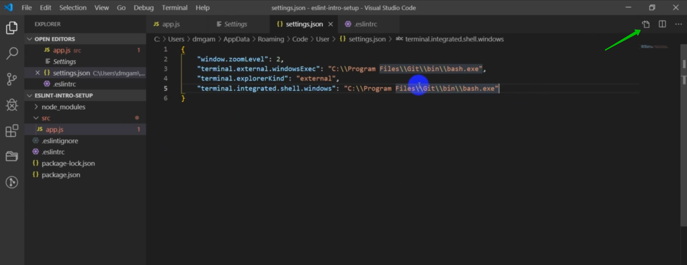

Это можно сделать и через **UI** консоль, но мне больше нравиться через **JSON** формат. Мы добавляем настройку **"editor.formatOnSave": true,** т.е. мы хотим что бы наш код форматировался при сохранении.

Далее для того что бы редактор автоматически не редактировал наши файлы своими свойствами, мы эту возможность отключаем, потому что мы это делать будем через ESLint. **"[javascript]:{"editor.formatOnSave": false }"**.

Дальше мы можем включить **"eslint.autoFixOnSave": true,** что бы у нас автоматически исправления применялись при сохранении. И если у вас **prettier** установлен именно плагином для **vscode** то мы его отключаем. **"prettier.disableLenguages": ["js"]**. Для того что бы он не редактировал **js** файлы. Иначе будут конфликты с **eslint**.

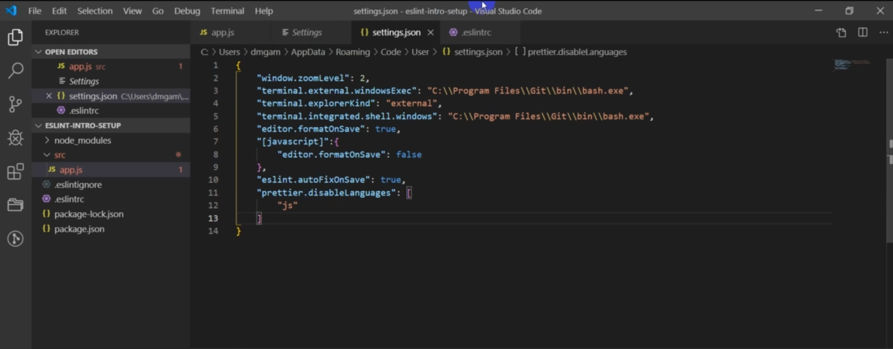
