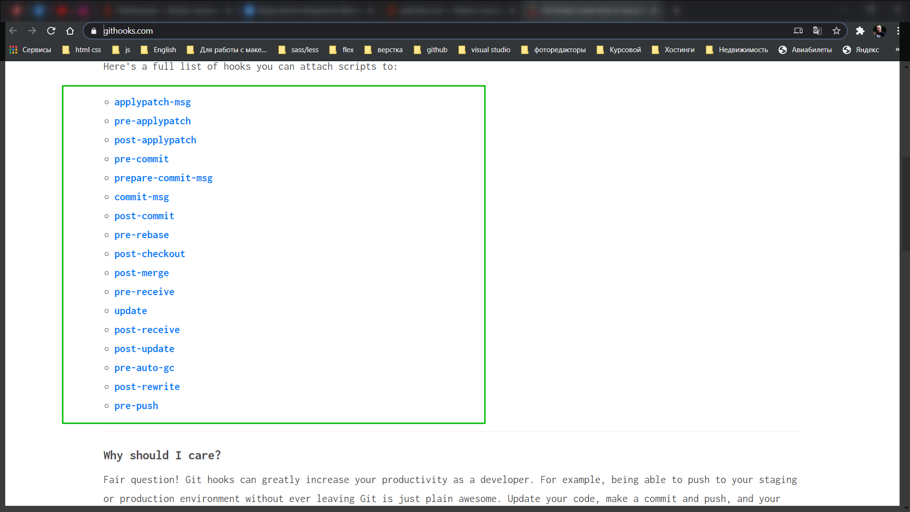
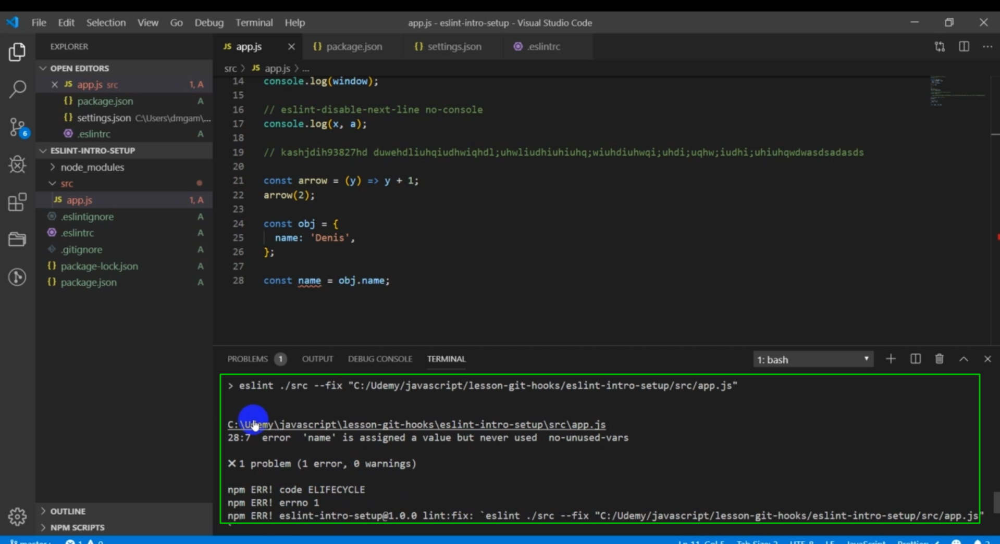
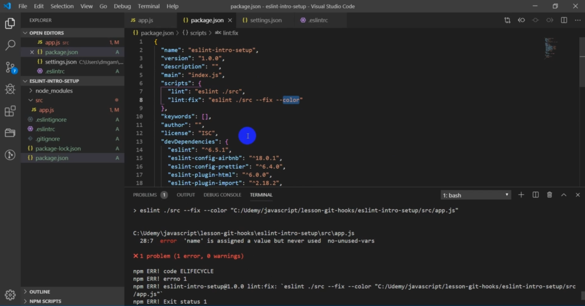

# Husky and Lint Staged

<br>
<br>

Документация **lint-staged** [https://github.com/okonet/lint-staged](https://github.com/okonet/lint-staged)

**Git hooks** [https://githooks.com/](https://githooks.com/)

**Документация husky** [https://github.com/typicode/husky](https://github.com/typicode/husky)

Статья по **eslint**, **prittier**, **husky** и **lint-staged** [https://habr.com/ru/company/ruvds/blog/428173/](https://habr.com/ru/company/ruvds/blog/428173/)

<br>
<br>

Познакомимся как сделать так что бы в наш репозиторий не попал код который не соответствует стандарту. Мы познакомимся с двумя пакетами **Husky** и** Lint Staged**

Пакет **Husky** позволяет задействовать или использовать **hooks** **git** т.е **live sickle hooks** у **git** которые вызываются в момент каких - то действий которые мы производим. Более подробно об этих **hooks** точнее их список можно увидеть на сайте [https://githooks.com/](https://githooks.com/). Здесь есть их список



Но обычно используется [pre-commit](https://github.com/git/git/blob/master/templates/hooks--pre-commit.sample) самый основной.

Это нам даст то что плохой код не попадет в наш репозиторий. Соответственно Husky нужен для того что бы привязаться к этим **hooks** и выполнить какие-то действия когда произойдет тот или иной **hook**.

**Lint Staged** - пакет который позволяет нам проверять с помощью **linter** индексированные файлы при этом он позволяет использовать различные шаблоны, каких файлов типов проверять и какие команды нужно вызывать после проверки в случае если проверка прошла успешно.

Перед тем как установить инициализирую **git** в проекте

```shell
git init
```

Создаю **.gitignore** и добавляю файлы и папки которые не долны попасть на удаленный репозиторий.

Далее устанавливаю пакеты.

```shell
npm i --save-dev husky lint-staged
```

В принципе отдельно как для **husky** так и для **lint-staged** можно создать отдельные файлы с конфигурацией, но мы можем их так же прописать в **package.json** часто их прописывают именно здесь.

```json
{
  "name": "test_project",
  "version": "1.0.0",
  "description": "",
  "main": "index.js",
  "scripts": {
    "lint": "eslint ./src",
    "lint:fix": "eslint ./src --fix"
  },
  "keywords": [],
  "author": "",
  "license": "ISC",
  "devDependencies": {
    "eslint": "^7.12.1",
    "eslint-config-airbnb": "^18.2.0",
    "eslint-config-prettier": "^6.15.0",
    "eslint-plugin-html": "^6.1.0",
    "eslint-plugin-import": "^2.22.1",
    "eslint-plugin-jsx-a11y": "^6.4.1",
    "eslint-plugin-prettier": "^3.1.4",
    "husky": "^4.3.0",
    "lint-staged": "^10.5.1"
  }
}
```

Прописываю настройки для **Husky**

```json
{
  "name": "test_project",
  "version": "1.0.0",
  "description": "",
  "main": "index.js",
  "scripts": {
    "lint": "eslint ./src",
    "lint:fix": "eslint ./src --fix"
  },
  "keywords": [],
  "author": "",
  "license": "ISC",
  "devDependencies": {
    "eslint": "^7.12.1",
    "eslint-config-airbnb": "^18.2.0",
    "eslint-config-prettier": "^6.15.0",
    "eslint-plugin-html": "^6.1.0",
    "eslint-plugin-import": "^2.22.1",
    "eslint-plugin-jsx-a11y": "^6.4.1",
    "eslint-plugin-prettier": "^3.1.4",
    "husky": "^4.3.0",
    "lint-staged": "^10.5.1"
  },
  "husky": {
    "hooks": {
      "pre-commit": "lint-staged"
    }
  }
}
```

Указываю что когда произойдет **"pre-commit"** я вызвываю пакет **"lint-staged"**. В объекте **hooks** я могу перечислять все наши хуки гита на которые мы хотим реагировать и выполнять какие-то действия.

Теперь настраиваю **lint-staged**. Более подробно о его настройках вы так же можете почитать [https://github.com/okonet/lint-staged](https://github.com/okonet/lint-staged). Здесь есть пояснения как что делать, какие есть настройки, какие есть шаблоны по файлам.

```json
{
  "name": "test_project",
  "version": "1.0.0",
  "description": "",
  "main": "index.js",
  "scripts": {
    "lint": "eslint ./src",
    "lint:fix": "eslint ./src --fix"
  },
  "keywords": [],
  "author": "",
  "license": "ISC",
  "devDependencies": {
    "eslint": "^7.12.1",
    "eslint-config-airbnb": "^18.2.0",
    "eslint-config-prettier": "^6.15.0",
    "eslint-plugin-html": "^6.1.0",
    "eslint-plugin-import": "^2.22.1",
    "eslint-plugin-jsx-a11y": "^6.4.1",
    "eslint-plugin-prettier": "^3.1.4",
    "husky": "^4.3.0",
    "lint-staged": "^10.5.1"
  },
  "husky": {
    "hooks": {
      "pre-commit": "lint-staged"
    }
  },
  "lint-staged": {
    "*.js": ["npm run lint:fix", "git add"]
  }
}
```

Теперь пробую сделать какой-то коммит и посмотрим как это отработает. **Делаю git add .**. После **git commit -m "first commit"**. После чего происходит проверка, находится ошибка, запускается **npm run lint:fix**.



Но это не подсвечивается. Для того что бы это подсвечивалось в **lint-staged** есть. Они предлагают добавлять для **eslint** дополнительный флаг **--color**.

```json
{
  "name": "test_project",
  "version": "1.0.0",
  "description": "",
  "main": "index.js",
  "scripts": {
    "lint": "eslint ./src",
    "lint:fix": "eslint ./src --fix --color"
  },
  "keywords": [],
  "author": "",
  "license": "ISC",
  "devDependencies": {
    "eslint": "^7.12.1",
    "eslint-config-airbnb": "^18.2.0",
    "eslint-config-prettier": "^6.15.0",
    "eslint-plugin-html": "^6.1.0",
    "eslint-plugin-import": "^2.22.1",
    "eslint-plugin-jsx-a11y": "^6.4.1",
    "eslint-plugin-prettier": "^3.1.4",
    "husky": "^4.3.0",
    "lint-staged": "^10.5.1"
  },
  "husky": {
    "hooks": {
      "pre-commit": "lint-staged"
    }
  },
  "lint-staged": {
    "*.js": ["npm run lint:fix", "git add"]
  }
}
```



Исправляю ошибки и добавление коммита происходит успешно.
